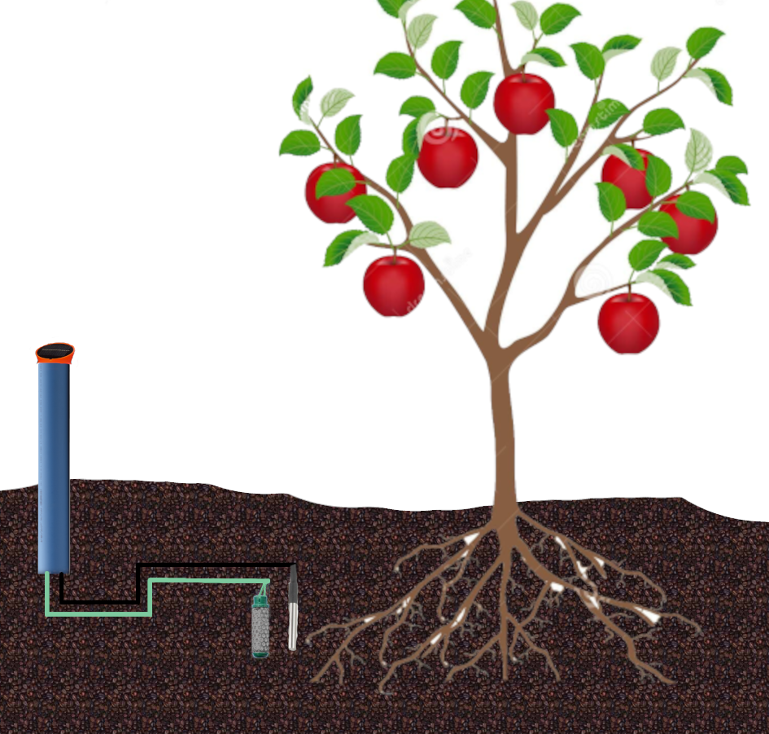

# Deploy a WaziSense for an agriculture use-case

## General information

For the purpose of developing IoT solutions and testing them in URBANE, we developed a new version of the development board “WaziSense”. This board will be used in the development and testing of the minimum viable products prosed hereafter (autonomic irrigation and weather station). It should be capable of supporting harsh outdoor environments. The WaziSense is an all-in-one style development board for projects involving outdoor sensing and agricultural 
purposes. Fitted with a LoRa sx1276 chip, it can communicate with a LoRa enabled gateway over long distances. It has terminal connectors which make it easy to hookup peripherals and deploy outdoor solutions with ease. This second version of the board has better energy control and optimization, aligning with our commitment to sustainability and resource conservation. It includes a Maximum Power Point Tracking (MPPT) solar charge controller. This enhancement eliminates the need for extra hardware to connect a solar panel and rechargeable battery, simplifying the setup process.

## Configurations

The WaziSense V2 can support different types of sensors and actuators. In the irrigation use-case we constructed 3 different device configurations:
- **WaziSenseV2** + **1x Watermark** 200SS (soil tension sensor) + **DS18B20** (soil temperature sensor)
- **WaziSenseV2** + **2x Watermark** 200SS (soil tension sensor) + **DS18B20** (soil temperature sensor)
- **WaziSenseV2** + 1x **SEN0308** (capacitive soil moisture sensor)

## Requirements

To deploy the WaziSense in the field you will need some tools, they are named here:

- **DN75 PVC sewage pipe**: 1.5 m - 2 m
    - is used as pole and case to house the micro-controller, protective cover for cables
- **Drill**: to drill in the PVC pipe
    - is not mandatory, but makes routing cables more convenient
- **Shovel**: of your choice
    - to dig a hole into the ground
- **2x Buckets**: ~10l 
    - one of them filled with **water**
- **Ruler**
    - to measure the depth of the digged hole 

Thats all, if you have those items, you will be able to deploy the devices.

## Preparation of Watermark 200SS

It is just a brief overview, to obtain more in detail information, consult the [Watermark 200SS installation guide](https://www.irrometer.com/pdf/701.pdf) (you can also find this guide in the provided box).

### Sensor Hydration Before Installation (RECOMMENDED)
1. Wet the sensor the 1st time by submerging less than halfway for 30 minutes in the morning.

2. Fully submerging the sensor will trap air inside it and will require drying the sensor completely and restarting this procedure. 

3. Submerging it only halfway lets air escape out of the pores above the water. It allows the capillary action to pull water into the inner pores. It is the fastest way to get the sensor prepared for installation.

4. Let it dry until the evening.

5. Wet the sensor a 2nd time by submerging less than halfway for 30 minutes that same evening.

6. Let it dry overnight. 

7. Wet the sensor a 3rd time by submerging less than halfway for 30 minutes the next morning and let dry until the evening. 

8. Finally, fully submerge the sensor over the 2nd night and install soaking wet in the 3rd morning. 

Full **sensor accuracy will be reached after 2 or more irrigation cycles**, depending on the soil’s wetness.

### Shortened Hydration Procedure (NOT-RECOMMENDED)
Soak the sensors overnight in irrigation water before installing the next day. A minimum of 8 hours should be allowed to let water penetrate into most of the inner matrix pores and for most of the air to get pushed out or dissolved in the water.

Full **sensor accuracy will be reached after 5 or more irrigation cycles**, depending on the soil’s wetness.

## Steps

In the following the steps are outlined to deploy a WaziSense with Watermark sensor attached to it. It is just a brief overview, to obtain more in detail information, consult the [Watermark 200SS installation guide](https://www.irrometer.com/pdf/701.pdf) (you can also find this guide in the provided box).

An illustration was created to visualize the process of installing the sensor devices in the ground.  

1. The very first step is to prepare your Watermark SS200 sensors, the procedure is explained in the former bullet point.
2. In the field, place them diagonally in different locations. If you have drip irrigation, do not place them to close to the pipe with holes.
3. The sensors have to be placed in the depth of the main root zone, this differs as per crop. For single devices, do not place them too deep, because then they will react on changes very slowly.
4. Dig a hole in the ground at the specific depth. Put the excavated soil into the empty bucket. The hole should be wide to facilitate the PVC pipe and the sensors.
5. Now put some water into the bucket with the soil from the ground, then stir it. It needs to be a slurry substance, to make good contact with the sensors.
6. Place the sensors into the hole. Now cover sensors **and wires** with soil water mix. The cables need to be routed through the pipe.
7. Now place the PVC pipe also into the hole. Be careful not to push the edge of the pipe against the cables, this is also illustrated above.
8. Now put the sensor device into the PVC pipes top end. Align the solar panel in south direction. Be careful again when pushing the device inside the PVC tube. If it does not fit accurately, sand down the PVC pipe, not the case of the WaziSense.

After one week to two weeks time you can obtain accurate sensor readings.

## Troubleshooting

Do not forget to read the official guide of the [Watermark 200SS installation guide](https://www.irrometer.com/pdf/701.pdf).

The steps on how to deploy a WaziGate are explained [here](prepared_deploy_guide.md).

If you have any further questions/problems, please do not hesitate to contact us.
You can reach out to us at contact@waziup.org. 